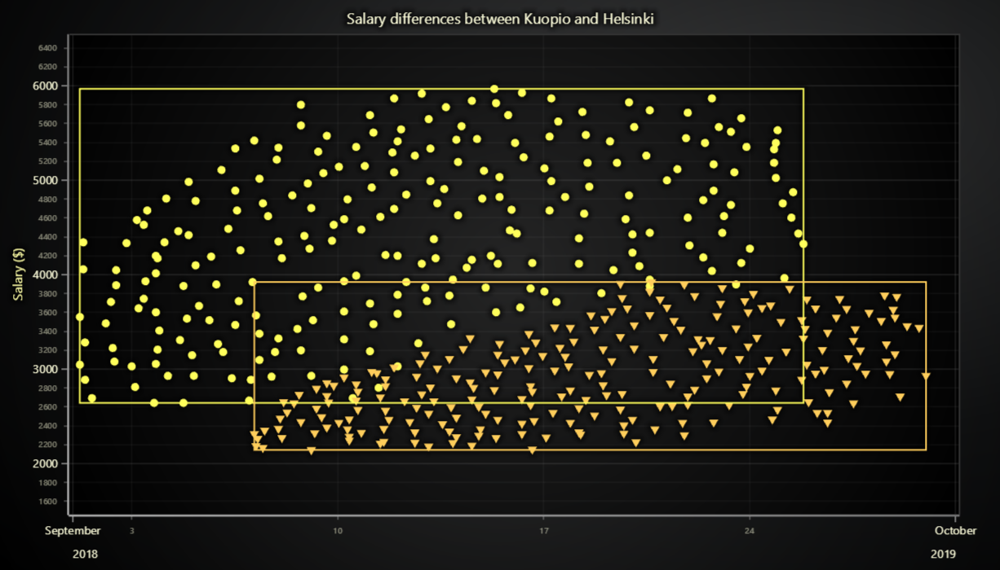

# JavaScript Point Clusters Chart



This demo application belongs to the set of examples for LightningChart JS, data visualization library for JavaScript.

LightningChart JS is entirely GPU accelerated and performance optimized charting library for presenting massive amounts of data. It offers an easy way of creating sophisticated and interactive charts and adding them to your website or web application.

The demo can be used as an example or a seed project. Local execution requires the following steps:

-   Make sure that relevant version of [Node.js](https://nodejs.org/en/download/) is installed
-   Open the project folder in a terminal:

          npm install              # fetches dependencies
          npm start                # builds an application and starts the development server

-   The application is available at _http://localhost:8080_ in your browser, webpack-dev-server provides hot reload functionality.


## Description

This example shows how to create clusters of differently colored points, how to get the boundaries of a series and use them to draw frames around each cluster.

The most efficient way to draw point cloud clusters is utilizing **_PointSeries_**. The description of how to configure the visual appearance of points can be found in previous tutorials and more information can be found in API documentation.

```javascript
//  Create point series which represents a single cluster.
const cluster = chart.addPointSeries()
```

## Boundaries

Each series automatically computes its boundaries based on the data input and configuration of a series. Get the boundaries in axis values using the following methods:

```javascript
// Cache min corner of a series (this would be bottom left on progressive axes).
const minCorner = {
    x: series.getXMin(),
    y: series.getYMin(),
}

// Cache max corner of a series (this would be top right on progressive axes).
const maxCorner = {
    x: series.getXMax(),
    y: series.getYMax(),
}
```

The boundary rectangle is defined by two points in 2D space. The same methods are applicable to all the series as well as **_progressive series_** in any directions.


## API Links

* [XY cartesian chart]
* [Point series]
* [Rectangle series]
* [Color palettes]
* [Solid FillStyle]
* [Empty FillStyle]
* [Solid LineStyle]


## Support

If you notice an error in the example code, please open an issue on [GitHub][0] repository of the entire example.

Official [API documentation][1] can be found on [LightningChart][2] website.

If the docs and other materials do not solve your problem as well as implementation help is needed, ask on [StackOverflow][3] (tagged lightningchart).

If you think you found a bug in the LightningChart JavaScript library, please contact sales@lightningchart.com.

Direct developer email support can be purchased through a [Support Plan][4] or by contacting sales@lightningchart.com.

[0]: https://github.com/Arction/
[1]: https://lightningchart.com/lightningchart-js-api-documentation/
[2]: https://lightningchart.com
[3]: https://stackoverflow.com/questions/tagged/lightningchart
[4]: https://lightningchart.com/support-services/

© LightningChart Ltd 2009-2022. All rights reserved.


[XY cartesian chart]: https://lightningchart.com/js-charts/api-documentation/v5.2.0/classes/ChartXY.html
[Point series]: https://lightningchart.com/js-charts/api-documentation/v5.2.0/classes/PointSeries.html
[Rectangle series]: https://lightningchart.com/js-charts/api-documentation/v5.2.0/classes/RectangleSeries.html
[Color palettes]: https://lightningchart.com/js-charts/api-documentation/v5.2.0/variables/ColorPalettes.html
[Solid FillStyle]: https://lightningchart.com/js-charts/api-documentation/v5.2.0/classes/SolidFill.html
[Empty FillStyle]: https://lightningchart.com/js-charts/api-documentation/v5.2.0/variables/emptyFill-1.html
[Solid LineStyle]: https://lightningchart.com/js-charts/api-documentation/v5.2.0/classes/SolidLine.html

